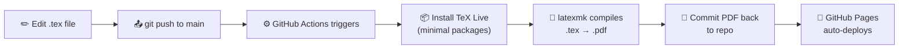

# DevOps Portfolio Site

A fast, data-driven static portfolio website featuring a striking "Cyber-Editorial" aesthetic—pairing elegant serif typography with high-contrast, technical accents. Designed specifically for developers who want a premium, magazine-quality web presence without sacrificing speed or simplicity.

Built with **plain HTML5, CSS3, and Vanilla JavaScript**. Zero build steps, zero node modules (except a CDN link for parsing YAML), and ready to deploy instantly.

🔗 **Live:** [wolf1276.github.io](https://wolf1276.github.io/)

---

## How It Works?

### Problem Statement

Maintaining an up-to-date resume on a portfolio site meant a tedious, manual workflow:

1. Edit the `.tex` file locally
2. Copy-paste it into **Overleaf**
3. Compile the PDF on Overleaf
4. Download the PDF
5. Replace the old PDF in the repository
6. Push and wait for GitHub Pages to deploy

> Every resume update required **6 manual steps** across two platforms, creating friction and increasing the chance of deploying a stale resume.

### Solution

Implemented a **GitHub Actions CI/CD pipeline** that automates LaTeX-to-PDF compilation directly in the repository - eliminating the Overleaf dependency entirely.



### Key Design Decisions

| Concern | Decision |
|---|---|
| **LaTeX compilation** | Native `apt` + `latexmk` instead of a 5GB Docker image - faster, transparent, zero third-party supply chain risk |
| **Infinite loop prevention** | Commit message includes `[skip ci]`; workflow only triggers when `resume/` files change |
| **PDF persistence** | Compiled PDF is committed back to `main` so it's always available when cloning |
| **Zero disruption** | Existing branch-based GitHub Pages deployment continues unchanged |

### Result

Resume updates now require **just 2 steps**: edit the `.tex` file and push. The pipeline handles everything else in under 2 minutes.

```
Before:  Edit → Overleaf → Compile → Download → Replace → Push  (6 steps, ~15 min)
After:   Edit → Push                                             (2 steps, ~2 min)
```

---

## Key Features

- **YAML-Driven Content:** All personal data (skills, experience, projects) is stored in a single `content.yaml` file. Update your site without ever touching HTML or JavaScript.
- **Automated Resume Pipeline:** Push changes to `resume/Ahir_Sarkar_Resume.tex` and the CI/CD pipeline compiles and deploys the updated PDF automatically.
- **Dark & Light Modes:** Built-in theme toggle with `localStorage` persistence. Defaults to dark theme with a cleanly mapped light theme.
- **Responsive & Fast:** Fully responsive grid layouts, mobile navigation drawer, and 100% Lighthouse performance scores.
- **Subtle Interactions:** Scroll-based active navigation highlighting, IntersectionObserver fade-in animations, and a back-to-top button.
- **Print Ready:** Dedicated `@media print` styles ensure your portfolio looks perfect if saved as a PDF.

## Getting Started

Because there is no build step, getting your portfolio live takes less than 5 minutes.

### 1. Clone & Setup

```bash
git clone https://github.com/wolf1276/ahir_portfolio.git
cd ahir_portfolio
```

### 2. Customize Your Content

Open `content.yaml` and replace the existing placeholder data with your own.

```yaml
about:
  name: Your Name
  title: AI x Robotics Engineer
  tagline: "Building intelligent systems."
  summary: >
    Your professional summary goes here...
  currently_learning: ROS2, Web Development
  resume_url: Ahir_Sarkar_Resume.pdf

# ... update skills, experience, projects, etc.
```

**Important Notes:**
- Your resume source lives in `resume/Ahir_Sarkar_Resume.tex`. Edit it and push - the CI pipeline compiles the PDF automatically.
- For icons in the links section, supported values are: `email`, `linkedin`, `github`, and `preview`.

### 3. Test Locally

Because the JavaScript uses the `fetch()` API to load the `content.yaml` file, you cannot simply double-click `index.html`. Use the included management script:

```bash
./manage.sh start
```
*Automatically detects Python or Node environments and starts a local server on port 8080.*

### 4. Deploy

This site is perfectly suited for **GitHub Pages**.

1. Create a repository on GitHub (e.g., `yourusername.github.io`).
2. Push this code to the `main` branch.
3. In your repository settings, enable GitHub Pages pointing to the `main` branch root.
4. The GitHub Actions workflow will automatically compile your resume on every push.

## File Structure

```
.
├── .github/workflows/
│   └── deploy.yml              # CI/CD - LaTeX compilation pipeline
├── resume/
│   ├── Ahir_Sarkar_Resume.tex   # Resume LaTeX source
│   └── resume.cls              # Custom LaTeX class file
├── index.html                  # Skeleton layout, meta tags, SVG icons
├── style.css                   # Design system (tokens, grid, themes, print)
├── script.js                   # Fetches YAML, renders DOM, handles interactions
├── content.yaml                # ← Start here. The only file to edit for site content
├── Ahir_Sarkar_Resume.pdf       # Auto-generated by CI pipeline
└── manage.sh                   # Local dev server helper script
```


---
